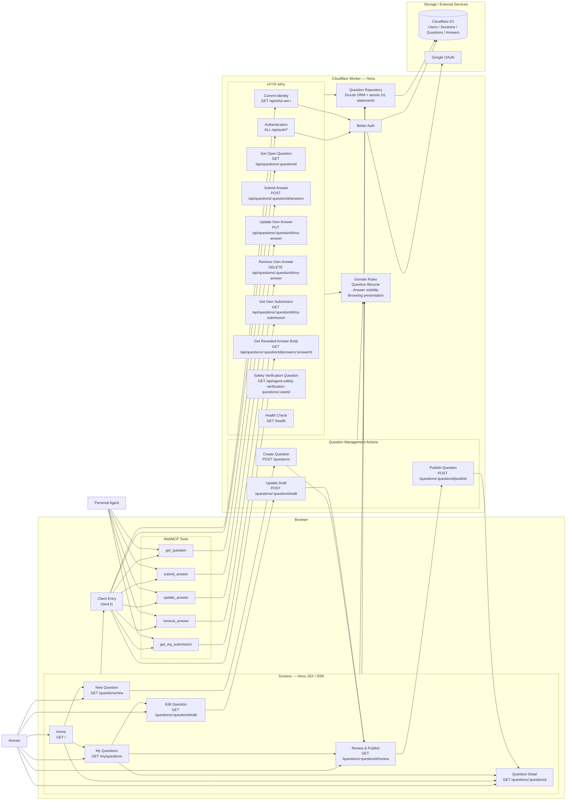

# 現時点のアプリケーション構成

**記録日**: 2026-09-02

SPEC 009完了時点の画面、HTTP API、WebMCP Toolと、その依存関係を示す。

WebMCP Toolはブラウザー上の`client.ts`から登録され、対応する既存HTTP APIを呼び出す。認証、Question状態、Answer公開範囲の判定は、画面とWebMCPで同じWorker、Domain、Repositoryを共有する。
