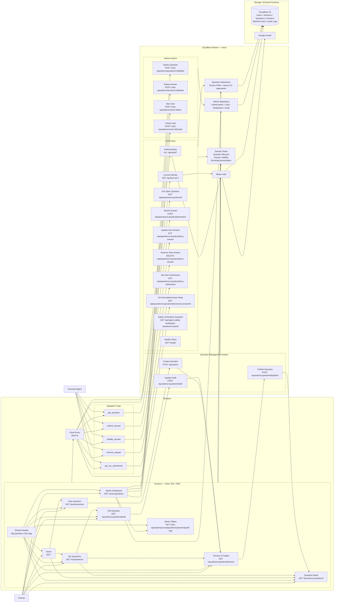

# Current Application Architecture

**Recorded**: 2026-09-02

This diagram shows the screens, HTTP APIs, WebMCP tools, and their dependencies after SPEC 009 completion.

WebMCP tools are registered from browser-side `client.ts` and call the corresponding existing HTTP APIs. Screens and WebMCP share the same Worker, domain, and repository for authentication, Question state, and Answer-disclosure decisions. Administration compares the Google Session with the configured email so only the administrator can list, delete, and ban.
